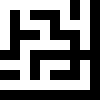
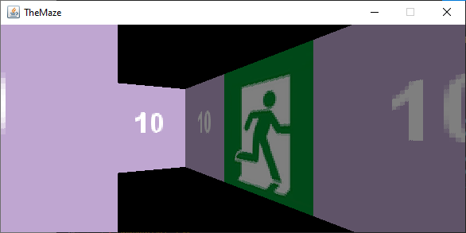
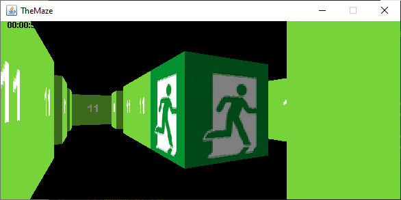
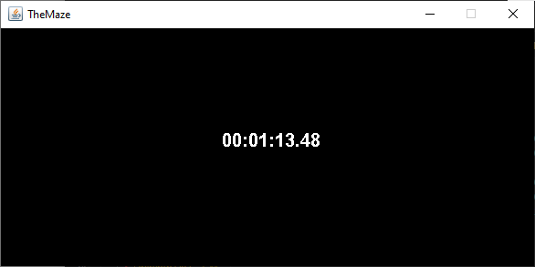

# Ultimate Maze Expierience
A game about escaping a maze - there is no lore FOR NOW, but it may be created in the future.

-[Maze generator](#maze-generator)

-[Image creation](#image-creation)

-[Build With](#build-with)

-[In game experience](#in-game-experience)

## Maze Generator

File labirynth.java defines a class with constructor that creates a maze of wanted size. It is an implementation of Prim's algortihm that has 4 key steps of creating a maze:

<ol>
    <li>Grid full of walls with dimensions x by y, where x and y are dimensions of the maze expected at the end</li>
    <li>Pick a random wall, turn it into the path and "officialy" make it a part of the maze, as well as 4 walls near it</li>
    <li>Pick a random wall AGAIN, but this time point number 2 is repeated only when it neighbours only ne path (wont create a loop)</li>
    <li>Repeat point number 3 until almost no walls from the original grid are "outside" the maze</li>
</ol>
File creates a text version of the maze.

## Image Creation

Class defined in imageCreator.java converts text-based maze into a png image similar to below:

It was created just for presentation purposes to show generated maze from above

## Used solutions and encountered problems

Normal keyboards don't know when user presses two keys at the same time. Because of that the movement that was implemented in the game is based on a HashSet object. When the key is pressed, its character code is being saved in the set and removed when the key is released. That creates proper smooth movement.

## In game experience:

## Build with
<ul>
<li>Java 23</li>
</ul>
